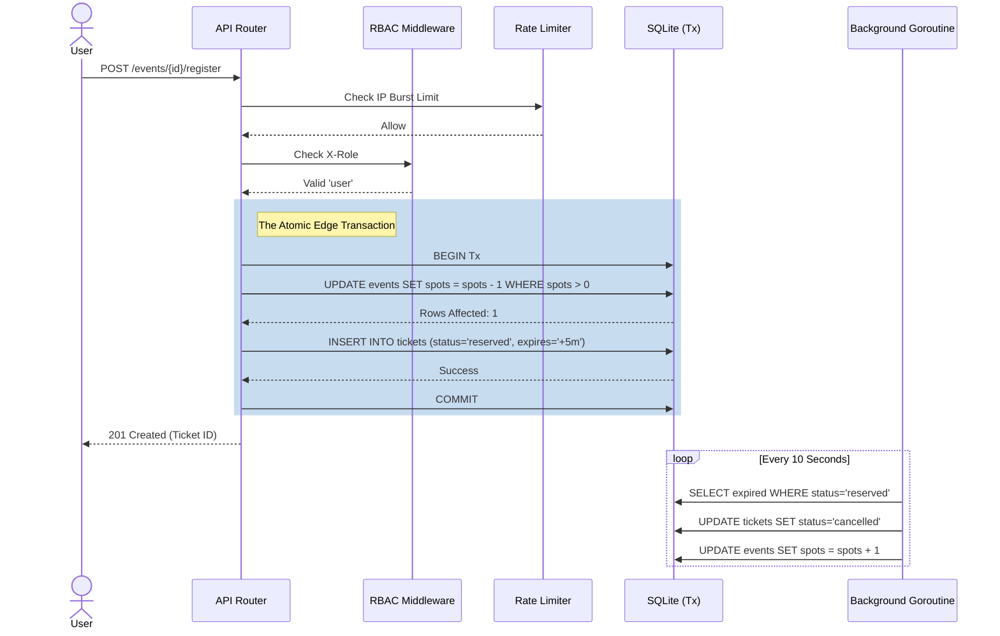

# Architecture & Design Document: Event Registration API

## 1. System Overview
The Event Registration & Ticketing API is designed to handle extremely high-throughput, concurrent registration events ("Ticket Flashes") securely. It circumvents the typical language-level limitations of synchronization by migrating concurrency resolution heavily to the persistent storage layer.

## 2. Technology Stack
- **Language**: Go 1.22+
- **Routing**: Standard Library `net/http` New Multiplexer
- **Database**: SQLite3 (`modernc.org/sqlite`)
- **Logging**: Standard Library `log/slog`

## 3. Concurrency Strategy: "The Atomic Edge"
The core requirement of a ticketing system is preventing overbooking. Standard monolithic applications often use `sync.Mutex` directly in memory to lock state. This is an anti-pattern for horizontal scaling and serverless architectures.

Instead, this system utilizes **Optimistic Concurrency Control (OCC)** heavily leaning into raw SQL atomic primitives:
1. **The Transaction (`sql.Tx`)**: Seat decrementing and ticket insertion are perfectly isolated together.
2. **The Atomic Update**: `UPDATE events SET available_spots = available_spots - 1 WHERE id = ? AND available_spots > 0;` dynamically blocks reservations once capacity drops to 0 without requiring prior memory reads.

### 3.1 Defensive Schema Design
The SQLite schema further protects invariants via rigid constraints:
- `CHECK (available_spots >= 0)` mathematically blocks any query that would result in negative seat capacity.
- `UNIQUE(event_id, user_email)` enforces business rules regarding duplicate purchases passively constraints on the storage layer.

## 4. Ticketing State Machine
A static ticketing system forces aggressive checkout flows. To handle real-world payment latency, a State Machine pattern was adopted for `tickets`.
- **States**: `reserved` | `confirmed` | `cancelled`
- **Background Reclamation**: When a `reserved` ticket is created, it asserts an `expires_at` column 5 minutes in the future. A background Goroutine dynamically crawls the database on a `time.Ticker` every 10 seconds. If `expires_at` passes without the client hitting `POST /tickets/{id}/confirm`, the row is set to `cancelled` and the `events.available_spots` column is natively incremented.

## 5. Security & Boundary Middlewares
1. **Role-Based Access Control (RBAC)**: Enforced via `X-Role` custom headers. It correctly separates Organizer abilities (provisioning events) from User constraints (booking tickets). `HTTP 403 Forbidden` acts as the semantic boundary line.
2. **Rate Limiting**: An in-memory, Mutex-secured token-bucket `RateLimitMiddleware` restricts active IPs to 5 requests per 10 seconds to explicitly defend the DB from burst abuse (`HTTP 429 Too Many Requests`).

## 6. Resilience
- **Idempotency Keys**: Accidental or automated network retries (`POST /register` fired twice due to a 504 Gateway Timeout) are intercepted by `idempotency_key UNIQUE`, stopping users from inadvertently purchasing duplicate tickets.
- **Graceful OS Shutdown**: The API captures `SIGTERM/SIGINT`. It dynamically drains in-flight HTTP transactions (giving them precisely a 5-second leeway to close the database transaction) before killing the main thread, stopping "torn" connections.

