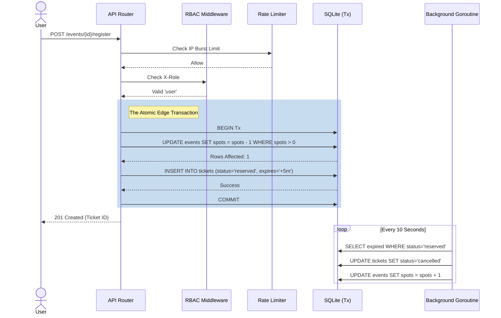

# Event Registration & Ticketing API

**Problem Statement Solved:** *Event Registration System (Concurrency Focus)* - Focusing on the safe prevention of race conditions and overbooking during high-volume, concurrent ticketing flashes.

A production-grade, highly-concurrent REST API for event registration and ticketing built strictly with **Go 1.22+ Standard Libraries** (`net/http`) and a portable **SQLite** database.

This project deliberately avoids massive web frameworks (like Gin or Fiber) and in-memory synchronization primitives (like `sync.Mutex`) to demonstrate deep fluency with Go's language primitives and database atomicity.

## Core Architectural Decisions

### 1. The Atomic Edge (Concurrency Strategy)
The core requirement of a ticketing system is preventing overbooking during highly concurrent registration events. 
Instead of relying on application-level locks that fail horizontally, we pushed the "Heavy Lifting" to the SQL layer via **Optimistic Concurrency Control**.

Seat decrementing and Ticket creation occur inside a strict ACID `sql.Tx` transaction utilizing a single atomic update:
```sql
UPDATE events SET available_spots = available_spots - 1 WHERE id = ? AND available_spots > 0;
```
This mathematically guarantees two simultaneous requests cannot both grab the final seat. Database `CHECK (available_spots >= 0)` constraints provide a secondary rigid defense against negative capacity.

### 2. The "Perfect Trio" of Business Maturity
To elevate this project from an "API" to a real-world "Commerce Platform", the following production features were implemented:

1. **Seat Reservation with Expiry**: Utilizing an intelligent state-machine in the `tickets` table (`reserved` -> `confirmed` or `cancelled`). A background Goroutine dynamically crawls the database checking `expires_at` and automatically reclaims spots for users who failed to finalize their checkout within 5 minutes.
2. **Role Based Access Control (RBAC)**: Enforced via Middleware. The system logically separates `organizer` routes (putting on an event) from `user` routes (registering for an event ticket) and returns `HTTP 403 Forbidden` on violations.
3. **Anti-Bot Rate Limiting**: An in-memory, Mutex-secured token-bucket `RateLimitMiddleware` restricts active IPs to 5 requests per 10 seconds to defend against burst abuse and brute-force bot scripts.

### 3. Enterprise Operations
- **Idempotency Keys**: Natively defends against duplicate network requests (e.g. users double-clicking "Buy") utilizing `idempotency_key UNIQUE` to prevent stealing spots.
- **Graceful Shutdown**: The server consumes `os/signal` SIGTERM events. It grants active database transactions exactly 5 seconds to cleanly commit or rollback before shutting down the process.
- **Go 1.21+ Structured Logging**: Emits clean observability metrics using `log/slog`.
- **Panic Protection**: A `RecoveryMiddleware` stops corrupted request payloads from crashing the server's memory block, cleanly returning `HTTP 500`.



---

## Running the Platform

Ensure Go is installed (`1.22` or greater).

```bash
# Start the server
go run .
```

*The server will boot on `:8080` and auto-initialize a pristine `events.db` SQLite database.*

### API Endpoints
All payloads use `application/json` encoded bodies.

- `POST /events` *(Requires header `X-Role: organizer`)*
- `GET  /events` *(Public)*
- `POST /events/{id}/register` *(Requires header `X-Role: user`)*
- `POST /tickets/{id}/confirm` *(Requires header `X-Role: user`)*

---

## The Concurrency Stress Test

The included test suite explicitly targets race condition vectors and proves the Optimistic SQL pattern is completely bulletproof.

It provisions an event with exactly **5 total spots**, and simultaneously launches **100 Goroutines** firing heavily concurrent HTTP transactions against the local machine.

Run it:
```bash
go test -v
```

**Expected Result:**
1. Exactly `5` Goroutines safely return `HTTP 200`.
2. Exactly `95` Goroutines are gracefully rejected with `HTTP 409 Conflict (Sold Out)`. 
3. Database constraints remain physically unbroken.

---
---

## Technical Specifications Prompt (Senior Architect Design Document)
*The following is the structured Product Requirements prompt used as the overarching architectural guideline for this application. It demonstrates the technical depth required to prompt a mature Golang system.*

> **System Architecture & Implementation Prompt:**
> "Act as a Senior Backend Staff Engineer. Design and implement a production-grade Event Registration & Ticketing REST API in Go. You must strictly use the standard library `net/http` from Go 1.22+ to handle multiplexing, bypassing bloated third-party routers. The persistence layer must be SQLite using `modernc.org/sqlite` (pure Go port) to guarantee zero-configuration compilation across cross-platform CI pipelines.
> 
> **1. Concurrency Defense (The Core Requirement):**
> Your core concurrency strategy must mathematically and flawlessly prevent overbooking. Do NOT use `sync.Mutex`. Instead, implement an Optimistic Concurrency Control (OCC) pattern. Decrement ticket capacity utilizing a conditional SQL `UPDATE events SET available_spots = available_spots - 1 WHERE available_spots > 0` bound strictly within an ACID `sql.Tx` transaction. Enforce database integrity using `CHECK (available_spots >= 0)` and `UNIQUE(event_id, email)` constraints to make the schema self-defending.
> 
> **2. The 'Perfect Trio' Product Requirements:**
> Elevate the system from a basic API to a mature Commerce Platform by implementing these three required features:
> - **State-Machine Ticketing (Seat Expiry):** Tickets must initially insert with `status='reserved'` and an `expires_at` column set 5 minutes into the future. Write a dedicated background Goroutine, attached to the main context, that sweeps the database every 10 seconds. It must atomically find expired rows, mark them `cancelled`, and dynamically return their spots to the parent event. Implement a `POST /tickets/{id}/confirm` checkout endpoint to lock the ticket status to `confirmed`.
> - **Role-Based Access Control (RBAC):** Build an `RBACMiddleware()` that validates standard requests. Enforce that `POST /events` requires an `organizer` role, while registration flows require a `user` role. Emit strict `HTTP 403 Forbidden` on violations.
> - **Anti-Bot Defense (Rate Limiting):** Build a `RateLimitMiddleware()` utilizing an in-memory, Mutex-bound sliding token bucket. Throttle IP addresses to exactly 5 requests per 10-second window, returning `HTTP 429 Too Many Requests`.
> 
> **3. Enterprise Operations:** 
> Implement standard REST semantics natively (201 Created, 400 Bad Request, 403 Forbidden, 409 Conflict for sold-out/duplicate states). Include `idempotency_key` logic within the `tickets` schema to neutralize network retry double-billing loops. Implement `os/signal` termination interception, granting in-flight HTTP connections exactly 5 seconds to drain or rollback cleanly before container shutdown. Finally, wrap all routes in a Go 1.21+ `log/slog` structured JSON telemetry logger and a Top-Level Panic `RecoveryMiddleware`.
>
> **4. Testing Parity:**
> Provide a `concurrent_test.go` suite using `sync.WaitGroup` and `sync/atomic`. It must simulate 100 heavily concurrent Goroutine HTTP requests simultaneously fighting for exactly 5 distinct database spots. Assert that exactly 5 succeed, exactly 95 fail gracefully with a specific error, and zero memory race conditions or SQLite deadlocks occur."
